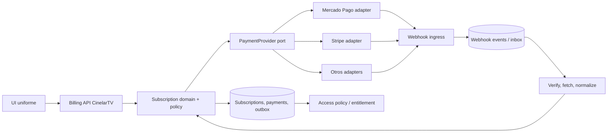
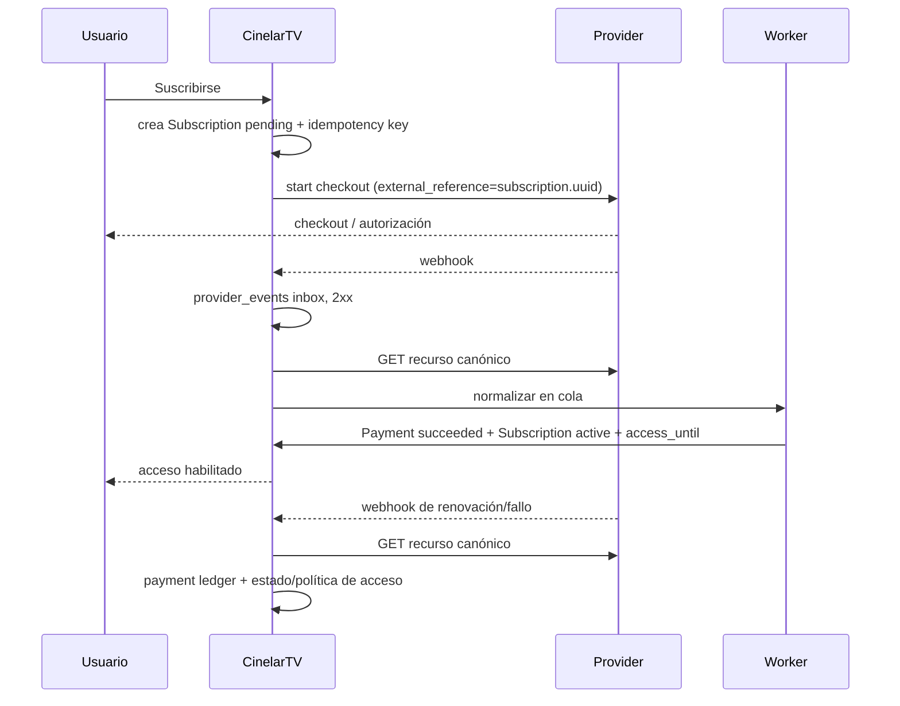

# CinelarTV: arquitectura de suscripciones

Fecha de investigación: 2026-08-04. Alcance: un único servicio comercial recurrente, con posibilidad de añadir ofertas futuras sin convertir el dominio presente en un catálogo de billing.

## Decisión ejecutiva

**CinelarTV debe ser dueño del acceso y del ciclo de vida comercial; el proveedor debe ser dueño del cobro y sus artefactos financieros.** Implementar una sola suscripción local por usuario, una capa de adaptadores por proveedor, un ledger inmutable de pagos y eventos entrantes, y una proyección local de elegibilidad. No exponer `preapproval`, `invoice`, `PaymentIntent`, ni estados de proveedores a la UI o a las reglas de acceso.

No crear hoy tablas `products`, `plans` ni `prices`. Definir una `Offering` de configuración/código (`cinelartv_membership_monthly`) con importe, moneda y periodicidad, y guardar un *snapshot* de esos términos en la suscripción. Cuando haya una segunda oferta real, migrarla a tabla sin cambiar el contrato de `Subscription`.

Para Mercado Pago, usar únicamente la **Subscriptions API programable** (`preapproval` y, opcionalmente, un único `preapproval_plan`) y crear/vincular todo desde CinelarTV. No mezclarla con “Subscription Plans” creados en el Dashboard: es una solución sin integración y su gestión es de Dashboard. Esta separación es explícita en la documentación de MP [sin programación](https://www.mercadopago.com.uy/developers/en/docs/subscription-plans/overview) y [con programación](https://www.mercadopago.com.uy/developers/en/docs/subscriptions/overview).

## Glosario y equivalencias

| Concepto | Definición y uso | Equivalencias / alcance |
|---|---|---|
| Suscripción | Relación continua que otorga el derecho a cobrar recurrentemente y, en CinelarTV, a acceder al servicio. | MP `preapproval`; Stripe `Subscription`; PayPal `Subscription`; Paddle/Lemon `Subscription`. No es un pago. |
| Pago recurrente | Cada intento/cobro periódico derivado de una suscripción. | MP `authorized_payment`/payment; Stripe Invoice + PaymentIntent; Paddle Transaction + Payment; PayPal sale/capture; Lemon subscription invoice/order. |
| Billing | El proceso de calcular qué se debe, emitir el cobro/factura, cobrar y recuperar deuda. | Stripe/Paddle tienen modelos de factura muy explícitos; MP expone facturas/cargos autorizados; no debe ser el motor de negocio de CinelarTV. |
| Mandato | Consentimiento del pagador para cargos futuros, habitual en débitos y tarjetas off-session. | En MP el `preapproval` es la autorización; Stripe SetupIntent puede crear el acuerdo; PayPal lo denomina acuerdo de suscripción. No es una entidad universal que CinelarTV deba modelar. |
| Payment Intent | Máquina de estados de un intento de pago que puede requerir autenticación. | Término propio de Stripe; no mapearlo literalmente. Stripe lo crea por cada invoice de suscripción. |
| Tokenización | Reemplazar datos de tarjeta por token/identificador no sensible para no almacenar PAN. | Todos la usan; la UI entrega token/PM al proveedor. CinelarTV **jamás** almacena token reutilizable, PAN o CVV. |
| Producto | Lo que se vende, concepto de catálogo. | PayPal Product, Stripe Product, Paddle Product, Lemon Product; MP programable no exige producto equivalente. Hoy es implícito: “CinelarTV”. |
| Plan | Plantilla de recurrencia/precio compartida. | MP `preapproval_plan`, PayPal Billing Plan; Stripe/Paddle/Lemon suelen separar Product/Price. No es la suscripción del usuario. |
| Precio | Importe, moneda y periodo comercial versionable. | Stripe/Paddle/Lemon Price; en MP/PayPal vive dentro del plan/suscripción. No es necesario como entidad local inicial. |
| Checkout | Experiencia para consentimiento y primer pago/captura de método. | Stripe Checkout, PayPal Buttons, Paddle Checkout, Lemon Checkout, URL `init_point` de MP. Es transporte, no fuente de verdad. |
| Invoice | Documento/obligación de cobro de un período; puede tener varios intentos de pago. | Central en Stripe/Paddle; MP `authorized_payment` es su factura/cargo de suscripción. Guardar localmente `Payment` como registro de cobro, no fingir una factura fiscal propia. |
| Renewal | Nueva obligación/cobro al siguiente período. | Un evento/resultado, no una entidad local: crea un `Payment` adicional y extiende `access_until`. |
| Webhook | Notificación HTTP asíncrona del proveedor. | Señal para consultar y sincronizar; nunca otorgar acceso sólo por el cuerpo no verificado. |
| Customer Portal | UI alojada por el proveedor para método, facturas y gestión. | Stripe/Paddle/Lemon lo ofrecen; MP/PayPal no equivalen de modo uniforme. CinelarTV debe ofrecer una UI propia y abrir una URL del adaptador sólo como implementación. |
| Payment Method | Instrumento de cobro (tarjeta, wallet, débito). | Identificador/metadata del proveedor. Localmente sólo marca, últimos 4 y vencimiento, si se reciben y son necesarios para UX. |
| Payment Provider | PSP/MoR que procesa cobros y mantiene objetos remotos. | MP, Stripe, PayPal son PSP; Paddle y Lemon Squeezy operan como Merchant of Record en su modelo comercial. No son parte del dominio de acceso. |

La distinción PaymentIntent/SetupIntent es específica de Stripe: el primero cobra y sigue su ciclo; el segundo guarda un método para cargos futuros sin cobrar ([Stripe](https://docs.stripe.com/payments/paymentintents/lifecycle)).

## Mercado Pago: modelo correcto y límites

### Dos productos que no se deben mezclar

1. **Subscription Plans (Dashboard):** se crea y comparte un link desde la cuenta MP, “sin necesidad de programación”. Permite administrar plan, suscriptores, pausas y cargos allí. Es apropiado para una operación manual, no para el dominio sincronizado de CinelarTV. El plan cancelado no cancela suscriptores existentes ([documentación](https://www.mercadopago.com.uy/developers/en/docs/subscription-plans/manage-subscription-plan)).
2. **Subscriptions API:** producto programable. Su contrato es `preapproval` (suscripción/autorización), opcionalmente vinculado a `preapproval_plan` (plantilla). MP genera `authorized_payments` (facturas/cargos programados) y payments. Puede crear una suscripción sin plan para un precio individual ([referencia](https://www.mercadopago.com.uy/developers/es/reference/online-payments/subscriptions/overview)).

No hay una semántica segura de “producto manual = producto API”. Aunque el Dashboard pueda mostrar o administrar datos según el flujo, su capacidad no es un contrato de integración. **Fuente operativa:** CinelarTV + API; Dashboard: observabilidad/soporte, no mutación rutinaria.

### Objetos, APIs y creación

| Objeto | API | Rol en CinelarTV |
|---|---|---|
| `preapproval_plan` | `POST/GET/PUT /preapproval_plan` | Una plantilla remota opcional, única, administrada por despliegue/configuración. Define monto/frecuencia; no contiene método de pago. |
| `preapproval` | `POST/GET/PUT /preapproval`, búsqueda/export | Suscripción del usuario y autorización. Incluye pagador, método, estado, recurrencia e `external_reference`. |
| `authorized_payment` | `GET /authorized_payments/{id}` y search | Factura/cargo recurrente; usarlo junto a `payment` para el historial. |
| `payment` | `GET /v1/payments/{id}`, search | Resultado final financiero. Verificar `status`, importe, moneda y `preapproval_id`. |

Un `preapproval` puede crearse con o sin plan. Con plan, MP toma configuración recurrente del plan; para plan asociado exige `card_token_id` y estado `authorized` según la guía ([crear asociado](https://www.mercadopago.com.uy/developers/en/docs/subscriptions/integration-configuration/subscription-associated-plan)). Sin plan, CinelarTV envía monto/frecuencia y se favorece para una sola oferta si evita que un plan remoto se convierta en fuente de verdad. El `init_point` es el checkout alojado y el resultado se confirma por API/webhook, no por `back_url` ([referencia de creación](https://www.mercadopago.com.uy/developers/en/reference/online-payments/subscriptions/create-preapproval/post)).

**Recomendación MP:** crear una única vez por entorno el `preapproval_plan` API si se desea reporte remoto agrupado; guardar su ID como configuración versionada y no permitir editarlo desde admin. Alternativa aún más simple: crear `preapproval` sin plan y conservar la oferta local como fuente de términos. En ambos casos, todos los `preapproval` deben llevar `external_reference = subscription.uuid` y `notification_url` específico del recurso. Nunca crear planes/preapprovals por click sin una idempotency key local.

### Estados, administración y cobro

La API permite buscar, cambiar importe y tarjeta, añadir medio secundario, pausar, cancelar y reactivar `preapproval`; cancelar es `PUT status=canceled` ([gestión](https://www.mercadopago.com.uy/developers/en/docs/subscriptions/subscription-management)). No traduzca literalmente todos esos estados: normalícelos. MP declara que maneja reintentos ante rechazo, pero no publica una política parametrizable completa: por ello `past_due` debe conservar acceso sólo durante una gracia definida por CinelarTV, y la reconciliación debe consultar facturas/pagos.

**Webhooks API de Suscripciones:** suscribirse como mínimo a `payment`, `subscription_preapproval` y `subscription_authorized_payment`; opcional `subscription_preapproval_plan` sólo para detectar edición accidental. La documentación indica que el webhook configurado “por Your Integrations” no aplica a Subscriptions; para esta integración debe configurarse al crear el recurso. MP reintenta entregas si no recibe 200/201 en 22 segundos y recomienda recuperar el recurso completo mediante API ([webhooks](https://www.mercadopago.com.uy/developers/en/docs/your-integrations/notifications/webhooks)). No existe un evento específico y universal equivalente a “entitlement granted”; tampoco debe esperarse un único evento final para todo el ciclo: procesar estado de preapproval, authorized payment y payment.

**Límites / riesgos concretos:** disponibilidad y medios varían por país; en Uruguay los tickets/efectivo no están disponibles para suscripciones ([medios](https://www.mercadopago.com.uy/developers/en/docs/sales-processing/payment-methods)). Las guías distinguen `pending` y `authorized`, y la tarjeta puede requerir validación/cobro mínimo. El método de pago se actualiza entregando un token nuevo, no almacenando tarjeta. La comunidad reporta confusión entre Checkout Pro y la API `preapproval`, notificaciones no recibidas y respuestas de prueba/validación de tarjeta; son testimonios no contractuales, no evidencia de plataforma. Mitigación: sólo el flujo documentado, endpoint alcanzable, firma verificada, cola, polling/reconciliación y pruebas sandbox con usuarios correctos. No diseñar sobre soluciones de foros.

## Comparación de modelos de proveedores

| Provider | Núcleo de datos y checkout | Cobro/recuperación | Portal y principal límite |
|---|---|---|---|
| **Mercado Pago** | `preapproval[_plan]` + authorized payment/payment; `init_point` o tokenización/API. | MP gestiona reintentos; detalle/política menos configurable. | Gestión Dashboard/API; no tratarlo como portal homogéneo. Fuerte en LATAM, modelo de suscripciones menos uniforme. |
| **Stripe** | Customer → Product/Price → Subscription; cada vencimiento crea Invoice + PaymentIntent. Checkout o Elements. | Smart Retries o reglas propias; `past_due` termina según configuración. | Customer Portal para método, facturas, cancelación. Más expresivo/automatizable, pero sus estados y objetos son más numerosos. [Modelo](https://docs.stripe.com/billing/subscriptions/overview), [portal](https://docs.stripe.com/customer-management). |
| **PayPal** | Catalog Product → Billing Plan → Subscription; aprobación en PayPal Buttons/checkout. | Reintento cada 5 días, hasta dos por ciclo; saldo pendiente y umbral configurable que suspende. | Administración de autopay PayPal, no un portal embebible equivalente a Stripe. [Integración](https://developer.paypal.com/docs/subscriptions/integrate/), [fallos](https://developer.paypal.com/docs/subscriptions/customize/payment-failure-retry/). |
| **Paddle** | Product/Price + Customer; checkout crea Subscription; cada renovación crea Transaction y sus Payments. No crea Subscription directo. | `past_due`, pause/cancel programado, transacciones separan obligación de intentos. | Portal hospedado con URLs temporales; invoices y método. MoR y fiscalidad simplifican venta internacional, pero no encaja si se necesita merchant local/control fiscal. [Modelo](https://developer.paddle.com/api-reference/subscriptions/). |
| **Lemon Squeezy** | Store/Product/Variant + Customer/Order/Subscription/Subscription invoice; checkout crea suscripción. | 4 reintentos en dos semanas; `past_due` mantiene acceso por defecto; luego `unpaid` y dunning configurable. | Portal hospedado, URLs firmadas 24h, métodos/facturas. MoR muy conveniente para SaaS digital, menor control/localización que un PSP. [Dunning](https://docs.lemonsqueezy.com/help/online-store/recovery-dunning), [webhooks](https://docs.lemonsqueezy.com/guides/developer-guide/webhooks). |

Todos exponen APIs, cancelación y webhooks. Paddle/Lemon crean suscripciones al pagar checkout; Stripe/PayPal/MP permiten una creación API más explícita. Todos pueden cambiar el método, pero la implementación es distinta: Stripe Portal/PaymentMethod, MP token nuevo sobre preapproval, Paddle Portal, Lemon URL firmada y PayPal administra su acuerdo. Por tanto, `change_payment_method` debe devolver una **acción de UI** (`redirect_url` o `client_secret`) y no una abstracción falsa de tarjeta.

### Webhooks y estados que importan

Suscripciones a recibir: Stripe `invoice.paid`, `invoice.payment_failed`, `customer.subscription.updated/deleted`; PayPal `BILLING.SUBSCRIPTION.*` y `PAYMENT.SALE.*` ([lista](https://developer.paypal.com/subscriptions/webhooks)); Paddle `subscription.*`, `transaction.*`, `transaction.payment_*`; Lemon `subscription_*`, especialmente payment success/failed/recovered; MP los tres tópicos anteriores más `payment`.

No usar la igualdad de estados remotos. Por ejemplo, Stripe `incomplete`, Paddle `past_due`, Lemon `unpaid` y MP `pending` tienen causas/garantías distintas. El adaptador transforma hechos remotos en eventos de dominio y la política CinelarTV decide acceso.

## Arquitectura propuesta



### Puertos y estrategias

El dominio expone sólo capacidades que hoy existen:

```ruby
PaymentProvider = Struct.new(:key) do
  def start_checkout(subscription:, return_url:) = raise NotImplementedError
  def fetch_subscription(remote_id:) = raise NotImplementedError
  def cancel(subscription:, at_period_end:) = raise NotImplementedError
  def payment_method_update_action(subscription:, return_url:) = raise NotImplementedError
  def parse_and_verify_webhook(request:) = raise NotImplementedError
  def reconcile(cursor:) = raise NotImplementedError
end
```

`ProviderRegistry` elige el adapter por la configuración de una suscripción, nunca por la UI. `start_checkout` devuelve `CheckoutAction` (`redirect`, URL, expiración), y actualización de método devuelve `CustomerAction`; no devuelve clases de SDK ni hashes de proveedor. Cada adapter implementa Anti-Corruption Layer: verifica firma, obtiene objeto remoto, correlaciona IDs, normaliza a `RemoteSubscriptionSnapshot`/`RemotePaymentSnapshot` y emite hechos como `payment_succeeded`, `payment_failed`, `subscription_cancelled`.

El Strategy Pattern debe quedarse en integración (adapter/selección); no crear una jerarquía de “plan strategies”. Los servicios de aplicación son: `StartSubscription`, `ProcessProviderEvent`, `CancelSubscription`, `RequestPaymentMethodUpdate`, `ReconcileProvider`, `GrantAccess` (operador). La política `AccessPolicy` sólo mira la proyección local.

### Fuente de verdad y eventos

* CinelarTV es fuente de verdad de usuario, oferta, elegibilidad, gracia y acceso.
* El proveedor es fuente de verdad de autorización, captura, estado financiero remoto y factura emitida por él.
* Los webhooks son **disparadores**, no comandos confiables ni el único ledger. Persistir raw payload + cabeceras + ID externo antes de encolar. Devolver 2xx sólo tras persistencia atómica.
* Usar inbox/outbox: el worker guarda cambio, payment y `DomainEvent` en la misma transacción; un publicador posterior comunica email/cache/analytics. Así un fallo no deja acceso modificado sin evento.

## Modelo de dominio mínimo

| Entidad | ¿ahora? | Responsabilidad |
|---|---|---|
| `Subscription` | Sí, una vigente/histórica por usuario | Contrato comercial local, estado normalizado, período de acceso, provider seleccionado y snapshot de oferta. |
| `Payment` | Sí | Ledger inmutable de cada invoice/cargo/intento final, importe/moneda/estado/IDs remotos. |
| `ProviderEvent` | Sí | Inbox auditable, deduplicación y reproceso. |
| `ProviderAccount` | Sí, configuración/secret references | Provider habilitado y credenciales vía secrets, no en JSON de pago. |
| `Customer` | No tabla nueva | El `User` ya es cliente CinelarTV. Guardar `provider_customer_id` en `provider_customers` sólo cuando el proveedor lo tenga y la reutilización lo justifique. |
| `PaymentMethod` | No como objeto financiero | Tabla opcional de metadata si UX lo exige; nunca token/PAN. El proveedor lo gestiona. |
| `Product`, `Plan`, `Price` | No | Prematuros con una oferta. Introducir `offerings` cuando exista la segunda combinación de precio/período. |
| `Entitlement` | No inicialmente | `Subscription#access_active?` basta para un único derecho. Crear tabla cuando haya varios derechos independientes. |

Estados canónicos de Subscription: `pending`, `active`, `past_due`, `cancelled`, `expired`. `cancelled` significa no renovará, pero `access_until` puede estar en el futuro; `expired` significa sin acceso. Una concesión admin no es un provider ni un sexto estado: guardar `access_grants` (`user_id`, `starts_at`, `ends_at`, `reason`, `granted_by`) y la política concede acceso si hay grant vigente. Esto elimina `granted` y las condiciones ambiguas actuales.

## Esquema PostgreSQL

```text
subscriptions
  id uuid PK, user_id FK users, uuid unique, offering_key text,
  status enum/text CHECK, provider_key text, provider_subscription_id text,
  provider_plan_id text nullable, provider_customer_id text nullable,
  amount_cents bigint, currency char(3), interval_unit text, interval_count int,
  current_period_started_at, current_period_ends_at, access_until,
  cancel_at_period_end boolean default false, cancelled_at, expired_at,
  grace_ends_at, remote_updated_at, last_reconciled_at,
  lock_version, created_at, updated_at
  UNIQUE(provider_key, provider_subscription_id) WHERE provider_subscription_id IS NOT NULL
  partial UNIQUE(user_id) WHERE status IN ('pending','active','past_due','cancelled')

payments
  id uuid PK, subscription_id FK, user_id FK, provider_key,
  provider_invoice_id nullable, provider_payment_id nullable,
  kind (initial|renewal|adjustment|refund), status (pending|succeeded|failed|refunded|disputed),
  amount_cents, currency, attempted_at, paid_at, failure_code, failure_message,
  raw_reference jsonb, created_at, updated_at
  UNIQUE(provider_key, provider_payment_id) WHERE provider_payment_id IS NOT NULL
  UNIQUE(provider_key, provider_invoice_id) WHERE provider_invoice_id IS NOT NULL

provider_events
  id uuid PK, provider_key, provider_event_id nullable, event_type,
  resource_type, resource_id, signature_valid boolean, occurred_at,
  received_at, processed_at, processing_error, payload jsonb, headers jsonb,
  payload_sha256, attempt_count
  UNIQUE(provider_key, provider_event_id) WHERE provider_event_id IS NOT NULL
  UNIQUE(provider_key, event_type, resource_id, payload_sha256)

access_grants
  id uuid PK, user_id FK, starts_at, ends_at, reason, granted_by_user_id FK users,
  revoked_at, created_at

provider_accounts
  id uuid PK, key unique, enabled, environment, settings jsonb (IDs no secretos),
  secret_reference text, last_reconciled_at, created_at, updated_at

domain_events/outbox
  id uuid PK, aggregate_type, aggregate_id, type, payload jsonb, occurred_at,
  published_at, attempts
```

`raw_reference` debe contener sólo IDs/metadata sanitaria, no secretos ni tarjeta. Mantener payload para auditoría con retención y acceso restringido. Para una migración segura, conservar `user_subscriptions` en lectura, crear las nuevas tablas, backfill por provider IDs, reconciliar, dual-read temporal, y después retirar columnas/provider statuses. No hacer una migración “big bang”.

## Flujo operativo



1. **Inicio:** transacción local crea `pending`; la clave de idempotencia es `(user_id, offering_key, request_uuid)`. Si ya hay activa/cancelada aún vigente, devolver su estado, no crear otra.
2. **Cliente/checkout:** adapter crea/reutiliza Customer remoto donde exista; pasa la correlación local en metadata/external reference. UI redirige; `return_url` muestra “Estamos verificando”, nunca “activa”.
3. **Primer pago:** webhook + GET remoto valida importe, moneda, usuario y relación. Sólo un pago exitoso activa. Si requiere acción/queda pendiente, se mantiene `pending` y se da acción de reintento.
4. **Renovación:** insertar/actualizar payment idempotentemente; si éxito, extender `current_period_ends_at`/`access_until` desde período remoto, no con `now + 30.days`.
5. **Rechazo/reintentos:** crear Payment failed; pasar a `past_due`, notificar y mostrar “Actualizar método”. Conservar acceso hasta `grace_ends_at` definido por negocio; los reintentos los ejecuta el proveedor. No duplicar dunning local salvo comunicaciones informativas.
6. **Método:** UI pide `CustomerAction`; abre Portal/checkout/tokenización del adapter. El webhook o fetch confirma el cambio. Nunca aceptar número de tarjeta en Rails.
7. **Cancelación:** marcar intención local `cancel_at_period_end`, ejecutar remote cancel y confirmar por GET/webhook. Mantener acceso hasta `access_until`; a su vencimiento `expired`. Si proveedor sólo soporta cancelación inmediata, mostrar esa consecuencia antes de confirmar.
8. **Reconciliación:** cada 15 min para pending/past_due y diariamente para activas/canceladas recientes; además job nocturno por cursor para pagos/recursos cambiados. El adapter trae snapshots; misma máquina de transición y ledger que el webhook.

## UX independiente del provider

**Cuenta del usuario:** una página “Suscripción” con tarjeta de estado, acceso hasta, próxima renovación, CTA contextual (Suscribirse / Actualizar método / Reintentar / Cancelar), historial de pagos y “Factura/recibo” sólo si `provider_invoice_url` está disponible. La acción abre una experiencia del provider cuando es necesario, pero los textos, estados y navegación siguen siendo CinelarTV. No ofrecer selector de provider salvo que negocio realmente permita al usuario elegirlo.

**Admin, máximo cuatro vistas:**

1. **Suscripciones:** búsqueda por usuario/estado, período/acceso, provider como detalle, cancelar, conceder/revocar acceso y “reconciliar”. No pantalla de planes.
2. **Pagos:** ledger filtrable, estado, importe, ID remoto y enlace seguro al Dashboard/provider cuando proceda; read-only salvo refund explícitamente diseñado.
3. **Incidencias/sincronización:** eventos fallidos, webhook signature/errors, replay seguro y última reconciliación. Puede ser tab admin, no producto visible diariamente.
4. **Configuración de cobros:** providers habilitados, credenciales por referencia, offering única, URLs/capacidades y estado de health. No editar objetos remotos desde aquí.

Customer/usuario no requiere pantalla separada: se navega desde Suscripciones. Eliminar “Planes” de la administración y “crear/editar plan” remoto. Mantener dashboards de proveedor como herramienta financiera, no como UX de CinelarTV.

## Casos límite y controles obligatorios

| Caso | Respuesta concreta |
|---|---|
| Duplicado | Índice por `provider_event_id`; fallback hash+tipo+resource. Payment con unique provider ID. Procesar dentro de transacción y usar lock de Subscription. Stripe también recomienda registrar event IDs y tolerar objetos duplicados ([guía](https://docs.stripe.com/webhooks)). |
| Perdido | Polling/reconciliación con cursor y ventana solapada; buscar por external reference/remote ID; alerta si `last_reconciled_at` vence. |
| Fuera de orden | GET del recurso canónico tras notificación; comparar `remote_updated_at`/versión; transiciones monotónicas. Un fallo viejo no degrada un pago posterior exitoso. |
| Pago exitoso sin webhook | Reconciliación detecta payment/invoice; añade ledger y activa. Back URL sólo dispara “sync now” autenticado. |
| Reintentos proveedor | No cobrar desde CinelarTV; reflejar attempts/payments y avisar. Política local de gracia explícita, por ejemplo 7 días, configurable y legalmente revisada. |
| Error temporal | Inbox durable, worker con backoff exponencial y dead-letter; 2xx sólo al persistir. Reintentar GET con idempotency y límites. |
| Cambio manual Dashboard | Reconciliación lo importa como hecho remoto, genera auditoría `external_change`; bloquear mutaciones manuales para operadores salvo runbook. |
| Datos inconsistentes | Remote gana para pago/autorización; CinelarTV gana para User/oferta/acceso. Marcar `needs_review` fuera del estado canónico si importe/moneda/correlación no coincide; nunca activar automáticamente. |
| Seguridad | Validar firma sobre raw body, timestamp/replay window, secret rotatable, TLS; no loguear datos de tarjeta. Autorización estricta para replay/admin. |

## Recomendaciones finales

* **Sí, hoy hay demasiadas entidades y estados si se copian los catálogos de providers.** Elimine `Product/Plan/Price` locales, `granted` como estado y los nombres de estados remotos del contrato/UI.
* Mantenga `Subscription`, `Payment`, `ProviderEvent`, `AccessGrant` y configuración de provider. Añada `provider_customers`/`payment_method_metadata` sólo al tener una necesidad concreta.
* CinelarTV decide oferta, precio publicado, elegibilidad, acceso, gracia, comunicaciones, correlación, auditoría y UX. Provider decide tokenización, SCA/mandato, cobro, retry/dunning, estado financiero remoto, recibo/factura que emite y portal remoto.
* Errores típicos: activar por `success_url`; usar webhook sin fetch; guardar tarjeta/token; usar status del proveedor como access policy; crear una abstracción que borra capacidades reales; tratar Dashboard manual y API como la misma fuente; no tener ledger, idempotencia ni reconciliación.
* Desde cero: una oferta hard-coded/versionada, una suscripción por usuario, checkout alojado, webhooks inbox + GET canónico, reconciliación y una única política `access_active?`. Sólo introducir catálogo, entitlements, prorrateo o invoices locales cuando haya una necesidad de producto verificable.

## Validación antes de implementación

Antes de elegir provider primario, ejecutar una matriz sandbox por país/moneda/método real: alta, primer pago fallido/3DS, renovación aprobada, rechazo y todos los reintentos, cambio de método, cancelación al fin de período, refund/chargeback, webhook duplicado/perdido y cambio manual. Registrar los payloads reales y ajustar cada adapter a hechos observados, no sólo a nombres de documentación.
